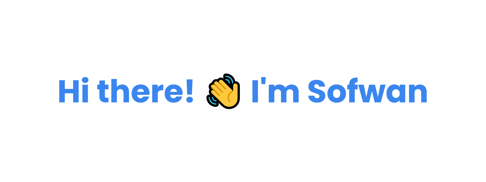

 

Hi there! 👋 I'm Sofwan  I'm a Software Engineer with over 6 years of experience  <b>Languages:</b> C++, Java, Python, JavaScript, PHP, C#, SQL <b>Technologies:</b> HTML, CSS, Bootstrap, JQuery, DataTables, Moment.js, Telerik, Node.js, Laravel, .NET, SQL Server, Github, Bitbucket, Azure DevOps Server, Power Platform
  

|  |  |
| ------------- | ------------- |
